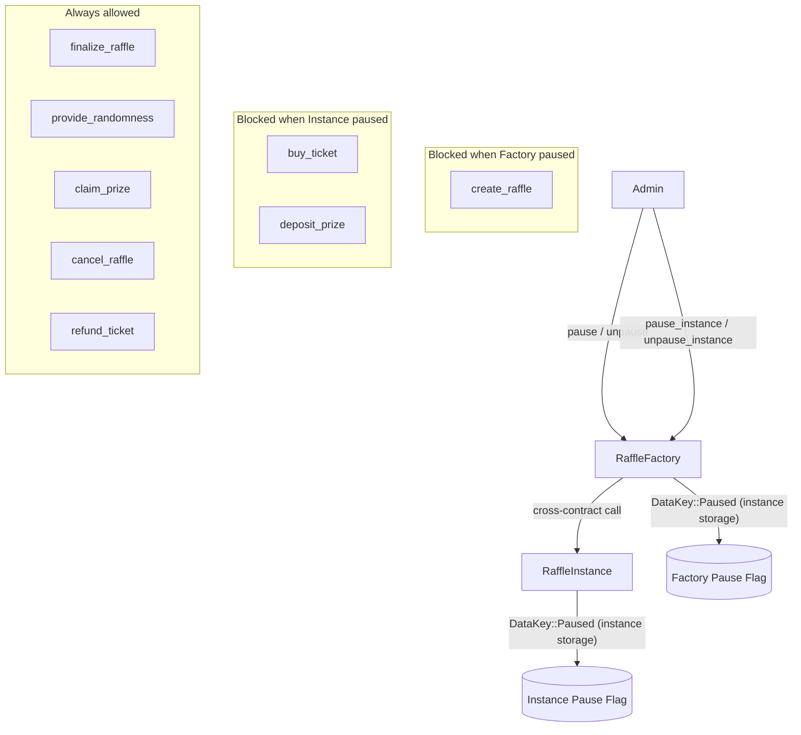

# Design Document: Emergency Pause & Migration (Circuit Breaker)

## Overview

This feature completes and formalises the circuit-breaker infrastructure that already exists in skeleton form across the Tikka raffle system. The goal is a two-level pause mechanism:

- **Factory level** – blocks new raffle creation (`create_raffle`).
- **Instance level** – blocks new fund inflows (`buy_ticket`, `deposit_prize`) while leaving all fund-recovery paths (`finalize_raffle`, `provide_randomness`, `claim_prize`, `cancel_raffle`, `refund_ticket`) fully operational.

The factory also acts as a single control point that can delegate pause/unpause to individual instances via `pause_instance` / `unpause_instance`.

Most of the scaffolding is already in place:

| Already exists | Still needed |
|---|---|
| `DataKey::Paused` in both contracts | `require_not_paused` guard in `RaffleInstance` |
| `pause` / `unpause` on `RaffleFactory` | `is_paused` view on `RaffleInstance` (already present) |
| `ContractPaused` / `ContractUnpaused` events | Comprehensive tests for instance-level pause |
| `require_factory_not_paused` on `create_raffle` | `pause_instance` / `unpause_instance` on factory (already present) |
| `pause` / `unpause` / `is_paused` on `RaffleInstance` | Tests for factory delegation |

The implementation delta is therefore small: add `require_not_paused` calls at the top of `buy_ticket` and `deposit_prize` in `RaffleInstance`, and write the test suite that validates all requirements.

---

## Architecture



The two pause flags are independent. Pausing the factory does not automatically pause existing instances; the admin must call `pause_instance` for each instance they want to freeze. This is intentional: it allows surgical containment of a single compromised raffle without affecting others.

---

## Components and Interfaces

### RaffleFactory (`contracts/raffle/src/lib.rs`)

All entry points are already implemented. No new entry points are required.

| Entry point | Auth | Behaviour |
|---|---|---|
| `pause()` | Factory_Admin | Sets `DataKey::Paused = true`, emits `ContractPaused` |
| `unpause()` | Factory_Admin | Sets `DataKey::Paused = false`, emits `ContractUnpaused` |
| `is_paused()` | None | Returns `instance().get(Paused).unwrap_or(false)` |
| `pause_instance(addr)` | Factory_Admin | Cross-contract call → `RaffleInstance::pause()` |
| `unpause_instance(addr)` | Factory_Admin | Cross-contract call → `RaffleInstance::unpause()` |
| `create_raffle(...)` | Creator | Guarded by `require_factory_not_paused` (already in place) |

### RaffleInstance (`contracts/raffle/src/instance/mod.rs`)

`pause`, `unpause`, and `is_paused` are already implemented. The only code change needed is adding `require_not_paused(&env)?;` at the top of `buy_ticket` and `deposit_prize`.

The helper `require_not_paused` already exists in the file (it is called inside `buy_ticket` and `deposit_prize` in the current code — confirmed by reading the source). If it does not exist as a standalone function it must be added:

```rust
fn require_not_paused(env: &Env) -> Result<(), Error> {
    if env.storage().instance().get(&DataKey::Paused).unwrap_or(false) {
        return Err(Error::ContractPaused);
    }
    Ok(())
}
```

| Entry point | Pause guard | Auth |
|---|---|---|
| `deposit_prize()` | `require_not_paused` | Creator |
| `buy_ticket(buyer)` | `require_not_paused` | Buyer |
| `finalize_raffle()` | None | Creator |
| `provide_randomness(seed)` | None | Oracle |
| `claim_prize(winner)` | None | Winner |
| `cancel_raffle(reason)` | None | Creator / Admin |
| `refund_ticket(id)` | None | Ticket owner |
| `pause()` | — | Factory address |
| `unpause()` | — | Factory address |
| `is_paused()` | — | None |

### Events (already defined in `contracts/raffle/src/events.rs`)

| Event struct | Fields | Emitted by |
|---|---|---|
| `ContractPaused` | `paused_by: Address`, `timestamp: u64` | `pause()` on both contracts |
| `ContractUnpaused` | `unpaused_by: Address`, `timestamp: u64` | `unpause()` on both contracts |

No new event types are needed.

---

## Data Models

### Storage layout

Both contracts use **instance storage** for `DataKey::Paused`. Instance storage is the correct choice because:

1. It is tied to the contract instance's ledger entry, so it survives TTL extension alongside all other instance-storage keys.
2. It avoids the per-key TTL management overhead of persistent storage for a single boolean flag.

```
RaffleFactory instance storage:
  DataKey::Paused  →  bool  (absent = false)

RaffleInstance instance storage:
  DataKey::Paused  →  bool  (absent = false)
```

### Default value semantics

Both contracts treat an absent key as `false`. This means:

- A freshly deployed factory is unpaused by default (no explicit initialisation needed).
- A freshly deployed raffle instance is unpaused by default.
- `init_factory` does not write `DataKey::Paused`, satisfying Requirement 7.3.

### DataKey enum (both contracts already have this)

```rust
// RaffleFactory (lib.rs) — already present
pub enum DataKey { ..., Paused, ... }

// RaffleInstance (instance/mod.rs) — already present
pub enum DataKey { ..., Paused, ... }
```

---

## Correctness Properties

*A property is a characteristic or behavior that should hold true across all valid executions of a system — essentially, a formal statement about what the system should do. Properties serve as the bridge between human-readable specifications and machine-verifiable correctness guarantees.*

### Property 1: Factory pause flag round-trip

*For any* sequence of `pause` and `unpause` calls on the RaffleFactory, `is_paused` SHALL return `true` if and only if the most recent call was `pause`.

**Validates: Requirements 1.2, 1.3, 7.4**

### Property 2: Instance pause flag round-trip

*For any* sequence of `pause` and `unpause` calls on a RaffleInstance, `is_paused` SHALL return `true` if and only if the most recent call was `pause`.

**Validates: Requirements 3.2, 3.3, 7.5**

### Property 3: Paused factory blocks create_raffle

*For any* valid set of `create_raffle` arguments, calling `create_raffle` while the factory is paused SHALL return `ContractError::ContractPaused` and leave the raffle instance list unchanged.

**Validates: Requirements 2.1**

### Property 4: Unpaused factory allows create_raffle

*For any* valid set of `create_raffle` arguments, calling `create_raffle` while the factory is not paused SHALL succeed and extend the raffle instance list by one.

**Validates: Requirements 2.2**

### Property 5: Paused instance blocks write operations

*For any* paused RaffleInstance in `Active` state, both `buy_ticket` and `deposit_prize` SHALL return `Error::ContractPaused` without modifying any on-chain state or transferring any tokens.

**Validates: Requirements 4.1, 4.2**

### Property 6: Exit operations unaffected by pause

*For any* paused RaffleInstance, all of `finalize_raffle`, `provide_randomness`, `claim_prize`, `cancel_raffle`, and `refund_ticket` SHALL complete with the same result as they would on an unpaused instance in the same state.

**Validates: Requirements 5.1, 5.2, 5.3, 5.4, 5.5**

### Property 7: Unauthorised pause/unpause rejected

*For any* address that is not the Factory_Admin (for the factory) or the stored Factory address (for an instance), calling `pause` or `unpause` SHALL return the appropriate `NotAuthorized` error.

**Validates: Requirements 1.4, 3.4, 6.3**

### Property 8: Factory delegation propagates pause to instance

*For any* RaffleInstance address, when the Factory_Admin calls `pause_instance(addr)` on the factory, the instance's `is_paused()` SHALL subsequently return `true`; when `unpause_instance(addr)` is called, it SHALL return `false`.

**Validates: Requirements 6.1, 6.2**

---

## Error Handling

| Scenario | Contract | Error returned |
|---|---|---|
| `pause` / `unpause` called by non-admin | RaffleFactory | `ContractError::NotAuthorized` |
| `pause` / `unpause` called by non-factory | RaffleInstance | `Error::NotAuthorized` |
| `create_raffle` while factory paused | RaffleFactory | `ContractError::ContractPaused` |
| `buy_ticket` while instance paused | RaffleInstance | `Error::ContractPaused` |
| `deposit_prize` while instance paused | RaffleInstance | `Error::ContractPaused` |
| `pause_instance` / `unpause_instance` by non-admin | RaffleFactory | `ContractError::NotAuthorized` |

All error paths return before any state mutation or token transfer, satisfying the "no state change on error" requirement.

---

## Testing Strategy

### Dual approach

Both unit tests (specific examples and edge cases) and property-based tests (universal properties across generated inputs) are required. They are complementary: unit tests catch concrete regressions; property tests verify general correctness across the input space.

### Unit tests (in `contracts/raffle/src/instance/test.rs` and a new factory test module)

Focus areas:
- Pause/unpause happy paths on both contracts, verifying `is_paused` return value and emitted events.
- `create_raffle` blocked when factory is paused; succeeds when unpaused.
- `buy_ticket` and `deposit_prize` blocked when instance is paused; succeed when unpaused.
- All exit operations (`finalize_raffle`, `provide_randomness`, `claim_prize`, `cancel_raffle`, `refund_ticket`) succeed while instance is paused.
- `pause_instance` / `unpause_instance` delegation from factory to instance.
- Unauthorised callers rejected on all pause/unpause entry points.
- Default `is_paused` returns `false` on a freshly initialised contract.

### Property-based tests

Use the [`proptest`](https://github.com/proptest-rs/proptest) crate (or `quickcheck` if already in the dependency tree).

Each property test MUST run a minimum of **100 iterations**.

Each test MUST include a comment in the format:
`// Feature: emergency-pause-migration, Property N: <property text>`

| Property | Test description |
|---|---|
| Property 1 | Generate random sequences of `pause`/`unpause` calls on the factory; assert `is_paused` matches last call |
| Property 2 | Same as Property 1 but for a RaffleInstance |
| Property 3 | For random valid `create_raffle` args, assert call fails with `ContractPaused` when factory is paused |
| Property 4 | For random valid `create_raffle` args, assert call succeeds and list grows by 1 when factory is unpaused |
| Property 5 | For random `buy_ticket` / `deposit_prize` inputs on a paused instance, assert `ContractPaused` and no state change |
| Property 6 | For random raffle states, assert exit operations return the same result regardless of pause flag |
| Property 7 | For random non-admin addresses, assert `pause`/`unpause` returns `NotAuthorized` |
| Property 8 | For random instance addresses, assert `pause_instance` / `unpause_instance` correctly propagates to instance `is_paused` |
