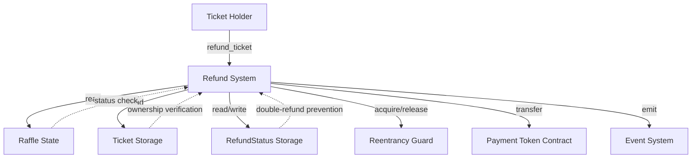
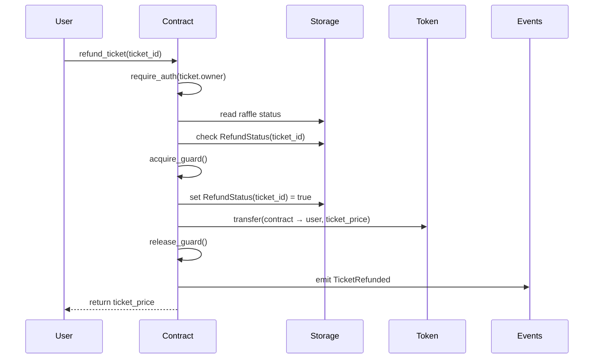

# Design Document: Ticket Refund System

## Overview

The Ticket Refund System enables ticket holders to reclaim their funds when a raffle is cancelled. This design implements a secure, pull-based refund mechanism that prevents double-claiming through persistent state tracking and protects against reentrancy attacks using the Checks-Effects-Interactions (CEI) pattern.

The system is built as part of the Tikka raffle smart contract on Soroban (Stellar blockchain) using Rust. It integrates with the existing raffle lifecycle, token transfer mechanisms, and event emission infrastructure.

Key design principles:
- Pull-based refunds: ticket holders initiate their own refunds
- Idempotency: each ticket can only be refunded once
- Reentrancy protection: guards prevent recursive calls during token transfers
- CEI pattern: state updates occur before external calls
- Event-driven: all refunds emit events for off-chain tracking

## Architecture

### System Context

The refund system operates within the raffle contract instance and interacts with:

1. **Raffle State**: Reads raffle status to verify cancellation
2. **Ticket Storage**: Retrieves ticket ownership and pricing information
3. **RefundStatus Storage**: Tracks which tickets have been refunded
4. **Token Contract**: Executes token transfers back to ticket holders
5. **Event System**: Publishes refund events for external monitoring

### Component Diagram



### Control Flow



## Components and Interfaces

### Public Interface

```rust
pub fn refund_ticket(env: Env, ticket_id: u32) -> Result<i128, Error>
```

**Parameters:**
- `env: Env` - Soroban environment providing access to storage, ledger, and contract context
- `ticket_id: u32` - Unique identifier of the ticket to refund

**Returns:**
- `Ok(i128)` - The refunded amount (ticket_price) on success
- `Err(Error)` - Specific error variant on failure

**Error Cases:**
- `Error::InvalidStateTransition` - Raffle not cancelled or ticket already refunded
- `Error::InvalidParameters` - Ticket does not exist
- `Error::NotAuthorized` - Caller is not the ticket owner
- `Error::Reentrancy` - Reentrancy guard already held

### Internal Components

#### 1. State Validation

Validates preconditions before processing refund:

```rust
// Check raffle is cancelled
if raffle.status != RaffleStatus::Cancelled {
    return Err(Error::InvalidStateTransition);
}

// Check ticket exists
let ticket = env.storage()
    .persistent()
    .get::<_, Ticket>(&DataKey::Ticket(ticket_id))
    .ok_or(Error::InvalidParameters)?;

// Check not already refunded
let is_refunded = env.storage()
    .persistent()
    .get(&DataKey::RefundStatus(ticket_id))
    .unwrap_or(false);
if is_refunded {
    return Err(Error::InvalidStateTransition);
}
```

#### 2. Authorization

Uses Soroban's built-in authorization mechanism:

```rust
ticket.owner.require_auth();
```

This ensures only the ticket owner can claim the refund. The authorization is cryptographically verified by the Soroban runtime.

#### 3. Reentrancy Guard

Prevents recursive calls during external token transfers:

```rust
fn acquire_guard(env: &Env) -> Result<(), Error> {
    if env.storage().instance().has(&DataKey::ReentrancyGuard) {
        return Err(Error::Reentrancy);
    }
    env.storage().instance().set(&DataKey::ReentrancyGuard, &true);
    Ok(())
}

fn release_guard(env: &Env) {
    env.storage().instance().remove(&DataKey::ReentrancyGuard);
}
```

The guard is stored in instance storage (contract-level, not persistent) and is acquired before state changes, released after token transfer completes.

#### 4. State Update (Effects)

Updates RefundStatus before external calls following CEI pattern:

```rust
env.storage()
    .persistent()
    .set(&DataKey::RefundStatus(ticket_id), &true);
```

This persistent storage entry ensures the refund status survives contract upgrades and is queryable across all contract instances.

#### 5. Token Transfer (Interaction)

Executes the actual refund transfer:

```rust
let token_client = token::Client::new(&env, &raffle.payment_token);
let contract_address = env.current_contract_address();
token_client.transfer(&contract_address, &ticket.owner, &raffle.ticket_price);
```

The transfer uses the same payment token and exact ticket price from the original purchase.

#### 6. Event Emission

Publishes refund event for off-chain tracking:

```rust
publish_event(
    &env,
    "ticket_refunded",
    TicketRefunded {
        buyer: ticket.owner.clone(),
        ticket_id,
        amount: raffle.ticket_price,
        timestamp: env.ledger().timestamp(),
    },
);
```

## Data Models

### Storage Keys

```rust
#[contracttype]
pub enum DataKey {
    Raffle,                    // Raffle state
    Ticket(u32),               // ticket_id -> Ticket
    RefundStatus(u32),         // ticket_id -> bool
    ReentrancyGuard,           // bool (instance storage)
    // ... other keys
}
```

### Core Data Structures

#### Raffle

```rust
#[contracttype]
pub struct Raffle {
    pub creator: Address,
    pub ticket_price: i128,
    pub payment_token: Address,
    pub status: RaffleStatus,
    pub tickets_sold: u32,
    // ... other fields
}
```

**Relevant Fields for Refunds:**
- `status: RaffleStatus` - Must be `Cancelled` for refunds
- `ticket_price: i128` - Amount to refund per ticket
- `payment_token: Address` - Token contract for transfers

#### Ticket

```rust
#[contracttype]
pub struct Ticket {
    pub id: u32,
    pub owner: Address,
    pub purchase_time: u64,
    pub ticket_number: u32,
}
```

**Relevant Fields for Refunds:**
- `id: u32` - Unique ticket identifier
- `owner: Address` - Address authorized to claim refund

#### RefundStatus

Stored as: `DataKey::RefundStatus(ticket_id) -> bool`

- `false` or absent: ticket not yet refunded
- `true`: ticket has been refunded

This simple boolean flag provides efficient idempotency checking.

#### TicketRefunded Event

```rust
#[contracttype]
pub struct TicketRefunded {
    pub buyer: Address,
    pub ticket_id: u32,
    pub amount: i128,
    pub timestamp: u64,
}
```

Published with topics: `("tikka", "ticket_refunded")`

### Storage Strategy

- **Raffle**: Instance storage (single raffle per contract)
- **Tickets**: Persistent storage (survives contract lifecycle)
- **RefundStatus**: Persistent storage (permanent record)
- **ReentrancyGuard**: Instance storage (temporary, per-call)

Persistent storage ensures refund status is maintained even if the contract is upgraded or archived.

