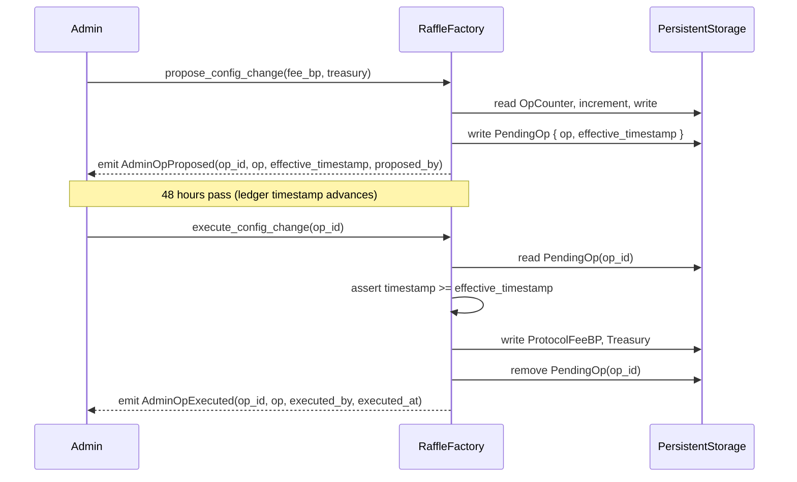
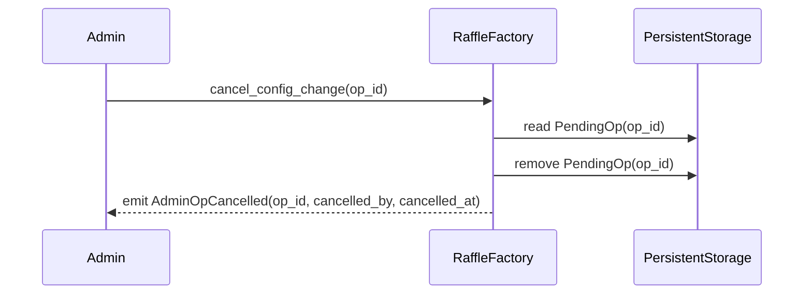

# Design Document: Time-Locked Admin Operations

## Overview

This feature replaces the immediate `set_config` entry point in the `RaffleFactory` contract with a propose → wait → execute lifecycle. Critical administrative changes (protocol fee basis points and treasury address) are queued as `PendingOp` entries with a mandatory 48-hour delay before they can be applied. This gives raffle participants time to observe proposed changes and exit before they take effect.

The implementation touches three files:
- `contracts/raffle/src/lib.rs` — new entry points, `DataKey` variants, `ContractError` variants, `AdminOp` type, `PendingOp` type, and the `TIMELOCK_DELAY_SECONDS` constant
- `contracts/raffle/src/events.rs` — three new event structs (`AdminOpProposed`, `AdminOpExecuted`, `AdminOpCancelled`)
- `contracts/raffle/src/instance/test.rs` (or a new `contracts/raffle/src/tests/timelock.rs`) — unit and property-based tests

## Architecture

The timelock system lives entirely within the `RaffleFactory` contract. No new contracts or cross-contract calls are introduced.



Cancel path:



## Components and Interfaces

### Constant

```rust
pub const TIMELOCK_DELAY_SECONDS: u64 = 172800; // 48 hours
```

### New `contracttype` definitions (in `lib.rs`)

```rust
/// Describes the type of administrative change being queued.
#[derive(Clone)]
#[contracttype]
pub enum AdminOp {
    SetConfig { protocol_fee_bp: u32, treasury: Address },
}

/// A queued administrative operation.
#[derive(Clone)]
#[contracttype]
pub struct PendingOp {
    pub op: AdminOp,
    pub effective_timestamp: u64,
    pub proposed_by: Address,
}
```

### New `DataKey` variants

```rust
pub enum DataKey {
    // ... existing variants ...
    PendingOp(u32),   // keyed by OpId
    OpCounter,        // monotonically incrementing u32
}
```

### New `ContractError` variants

```rust
pub enum ContractError {
    // ... existing variants ...
    TimelockNotElapsed = 6,
    NoPendingOp = 7,
}
```

### New entry points on `RaffleFactory`

```rust
pub fn propose_config_change(env: Env, protocol_fee_bp: u32, treasury: Address) -> Result<u32, ContractError>
pub fn execute_config_change(env: Env, op_id: u32) -> Result<(), ContractError>
pub fn cancel_config_change(env: Env, op_id: u32) -> Result<(), ContractError>
pub fn get_pending_op(env: Env, op_id: u32) -> Option<PendingOp>
pub fn get_op_counter(env: Env) -> u32
```

`set_config` is removed entirely.

### New event structs (in `events.rs`)

```rust
#[derive(Clone)]
#[contracttype]
pub struct AdminOpProposed {
    pub op_id: u32,
    pub op: AdminOp,
    pub effective_timestamp: u64,
    pub proposed_by: Address,
}

#[derive(Clone)]
#[contracttype]
pub struct AdminOpExecuted {
    pub op_id: u32,
    pub op: AdminOp,
    pub executed_by: Address,
    pub executed_at: u64,
}

#[derive(Clone)]
#[contracttype]
pub struct AdminOpCancelled {
    pub op_id: u32,
    pub cancelled_by: Address,
    pub cancelled_at: u64,
}
```

## Data Models

### Storage layout

| Key | Storage type | Value type | Description |
|-----|-------------|------------|-------------|
| `DataKey::OpCounter` | Persistent | `u32` | Monotonically incrementing counter; starts at 0, first op_id is 1 |
| `DataKey::PendingOp(op_id)` | Persistent | `PendingOp` | One entry per queued operation |
| `DataKey::ProtocolFeeBP` | Persistent | `u32` | Applied by `execute_config_change` |
| `DataKey::Treasury` | Persistent | `Address` | Applied by `execute_config_change` |

### `PendingOp` lifecycle

```
propose_config_change  →  PendingOp stored at DataKey::PendingOp(op_id)
                                    │
                    ┌───────────────┴───────────────┐
                    ▼                               ▼
         execute_config_change            cancel_config_change
         (after timelock elapses)         (any time)
         applies config, removes op       removes op
```

### Counter assignment

```
initial state: OpCounter = 0 (absent → treated as 0)
first propose:  OpCounter becomes 1, op_id = 1
second propose: OpCounter becomes 2, op_id = 2
...
```

The counter never decrements. Cancelled or executed ops do not reclaim their id.

## Correctness Properties

*A property is a characteristic or behavior that should hold true across all valid executions of a system — essentially, a formal statement about what the system should do. Properties serve as the bridge between human-readable specifications and machine-verifiable correctness guarantees.*

### Property 1: Admin-only authorization

*For any* call to `propose_config_change`, `execute_config_change`, or `cancel_config_change` made by an address that is not the stored Admin, the contract SHALL return `ContractError::NotAuthorized`.

**Validates: Requirements 1.1, 1.5, 2.1, 2.7, 3.1, 3.5**

### Property 2: Propose round-trip storage

*For any* valid `protocol_fee_bp` and `treasury` address, after calling `propose_config_change`, calling `get_pending_op` with the returned `op_id` SHALL return a `PendingOp` whose `op` matches the proposed parameters and whose `effective_timestamp` equals the ledger timestamp at proposal time plus `TIMELOCK_DELAY_SECONDS`.

**Validates: Requirements 1.2, 4.1, 8.1, 8.4**

### Property 3: Counter monotonically increments

*For any* sequence of N calls to `propose_config_change`, the value returned by `get_op_counter` SHALL equal the number of proposals made, and each successive `op_id` SHALL be exactly one greater than the previous.

**Validates: Requirements 1.3, 4.2, 8.2**

### Property 4: Propose emits correct event

*For any* valid proposal, the emitted `AdminOpProposed` event SHALL contain the correct `op_id`, the `AdminOp` payload matching the proposed parameters, the correct `effective_timestamp`, and the proposer address, published under the `("tikka", "admin_op_proposed")` topic.

**Validates: Requirements 1.4, 7.1, 7.4**

### Property 5: Execute applies config and removes pending op

*For any* pending op whose `effective_timestamp` has elapsed, after calling `execute_config_change`, the stored `ProtocolFeeBP` and `Treasury` SHALL match the op's parameters, and `get_pending_op(op_id)` SHALL return `None`.

**Validates: Requirements 2.2, 2.3, 8.3**

### Property 6: Execute emits correct event

*For any* successful execution, the emitted `AdminOpExecuted` event SHALL contain the correct `op_id`, the `AdminOp` payload, the executor address, and the execution timestamp, published under the `("tikka", "admin_op_executed")` topic.

**Validates: Requirements 2.4, 7.2, 7.4**

### Property 7: Timelock guard

*For any* pending op, calling `execute_config_change` at any ledger timestamp strictly less than `effective_timestamp` SHALL return `ContractError::TimelockNotElapsed`, and the stored config SHALL remain unchanged.

**Validates: Requirement 2.5**

### Property 8: Multiple ops coexist

*For any* N proposals made without intervening executions or cancellations, all N `PendingOp` entries SHALL be independently retrievable by their distinct `op_id` values.

**Validates: Requirement 1.6**

### Property 9: Cancel removes pending op

*For any* pending op, after calling `cancel_config_change`, `get_pending_op(op_id)` SHALL return `None`, and the stored `ProtocolFeeBP` and `Treasury` SHALL remain unchanged.

**Validates: Requirements 3.2, 8.3**

### Property 10: Cancel emits correct event

*For any* successful cancellation, the emitted `AdminOpCancelled` event SHALL contain the correct `op_id`, the canceller address, and the cancellation timestamp, published under the `("tikka", "admin_op_cancelled")` topic.

**Validates: Requirements 3.3, 7.3, 7.4**

## Error Handling

| Error | Condition | Entry points |
|-------|-----------|-------------|
| `ContractError::NotAuthorized` | Caller is not the stored Admin | `propose_config_change`, `execute_config_change`, `cancel_config_change` |
| `ContractError::TimelockNotElapsed` | `env.ledger().timestamp() < effective_timestamp` | `execute_config_change` |
| `ContractError::NoPendingOp` | `DataKey::PendingOp(op_id)` absent from persistent storage | `execute_config_change`, `cancel_config_change` |

`get_pending_op` and `get_op_counter` are infallible view functions — they return `Option<PendingOp>` and `u32` respectively and never panic.

`init_factory` continues to set `ProtocolFeeBP` and `Treasury` directly (bootstrap exemption per Requirement 5.2).

## Testing Strategy

### Dual testing approach

Both unit tests and property-based tests are required. Unit tests cover specific examples and error conditions; property tests verify universal correctness across randomized inputs.

**Property-based testing library**: [`proptest`](https://github.com/proptest-rs/proptest) (Rust). Each property test runs a minimum of 100 iterations.

Each property test MUST include a comment tag in the format:
`// Feature: time-locked-admin-operations, Property N: <property_text>`

### Unit tests (specific examples and error conditions)

- `test_init_factory_sets_config_directly` — verifies bootstrap exemption (Req 5.2)
- `test_constant_value` — asserts `TIMELOCK_DELAY_SECONDS == 172800` (Req 6.1)
- `test_get_pending_op_returns_none_for_missing_id` — `get_pending_op` on absent key returns `None` (Req 4.1)
- `test_get_op_counter_returns_zero_before_any_proposal` — counter starts at 0 (Req 4.2)
- `test_execute_returns_no_pending_op_for_missing_id` — error path (Req 2.6)
- `test_cancel_returns_no_pending_op_for_missing_id` — error path (Req 3.4)
- `test_view_functions_require_no_auth` — `get_pending_op` and `get_op_counter` callable without auth (Req 4.3)
- `test_set_config_removed` — compile-time: `set_config` no longer exists (Req 5.1, verified by absence in source)

### Property-based tests

Each property below maps to one property-based test:

| Test name | Property | Min iterations |
|-----------|----------|---------------|
| `prop_admin_only_authorization` | Property 1 | 100 |
| `prop_propose_round_trip_storage` | Property 2 | 100 |
| `prop_counter_monotonically_increments` | Property 3 | 100 |
| `prop_propose_emits_correct_event` | Property 4 | 100 |
| `prop_execute_applies_config_and_removes_op` | Property 5 | 100 |
| `prop_execute_emits_correct_event` | Property 6 | 100 |
| `prop_timelock_guard` | Property 7 | 100 |
| `prop_multiple_ops_coexist` | Property 8 | 100 |
| `prop_cancel_removes_pending_op` | Property 9 | 100 |
| `prop_cancel_emits_correct_event` | Property 10 | 100 |

### Generator strategy

Since Soroban's test environment (`soroban_sdk::testutils`) does not integrate directly with `proptest` generators, property tests will use a hybrid approach:

1. Use `proptest` to generate raw Rust values (`u32` for `protocol_fee_bp`, random byte arrays for address seeds).
2. Construct `soroban_sdk::Address` values from generated seeds using `Address::from_contract_id` or `Address::generate` within a fresh `Env`.
3. Advance the ledger timestamp using `env.ledger().set_timestamp(t)` to test timelock boundary conditions.

This approach keeps property tests deterministic and reproducible while exercising the full range of valid inputs.
