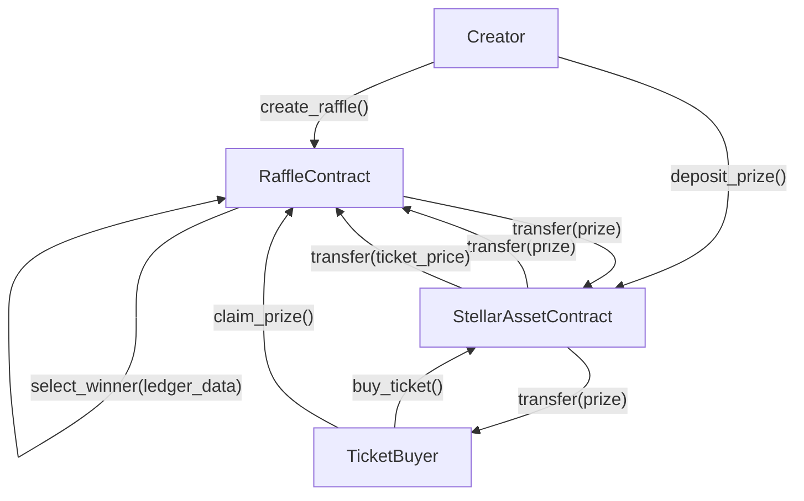

# Tikka - Decentralized Raffle Platform


## 🎯 What is Tikka?

Tikka is a decentralized raffle platform built on Stellar using Soroban smart contracts. Users can create raffles, sell tickets priced in Stellar assets, and distribute prizes securely on-chain.

## 🚀 Key Features

### **🎲 On-Chain Winner Selection (Demo)**

-   Deterministic winner selection derived from ledger data (timestamp + sequence)
-   Simple and transparent process for a demo contract
-   Designed for clarity, not production-grade randomness

### **💰 Token-Based Tickets and Prizes**

-   **Ticket Purchases**: Any Stellar asset contract
-   **Prizes**: Same asset used for ticket purchases
-   **Flexible Pricing**: Set ticket prices and prize amount per raffle

### **🔒 Escrowed Prizes**

-   Prizes are held in the smart contract until finalization
-   Winners claim prizes after the raffle ends

### **📊 Basic Raffle Analytics**

-   Total tickets sold per raffle
-   Winner tracking and claim status

## 🏗️ How Tikka Works

### **1. Raffle Creation**

```
Creator → Create Raffle → Set Parameters
```

-   Raffle creators specify:
    -   Description and end time
    -   Maximum ticket count
    -   Ticket price and payment asset
    -   Whether multiple tickets per person are allowed
    -   Prize amount (in the same payment asset)

### **2. Prize Escrow**

```
Creator → Deposit Prize → Contract Escrow
```

-   Prizes are transferred to the smart contract
-   Contract holds the prize until raffle finalization

### **3. Ticket Sales**

```
Participants → Buy Tickets → Contract Validation → Ticket Issuance
```

-   Users purchase tickets with the raffle asset
-   Contract validates payment and issues tickets
-   One ticket equals one entry in the raffle

### **4. Winner Selection**

```
Raffle Ends → Finalize → Select Winner
```

-   Winner is selected from sold tickets
-   Selection uses ledger-derived data for demo purposes

### **5. Prize Distribution**

```
Winner Selected → Claim Prize
```

-   Winners claim their prizes

### **Raffle Flow Diagram**



## 🔧 Technical Architecture

### **Smart Contract Stack**

-   **Soroban (Rust)**: Smart contract implementation
-   **Stellar**: Network and asset contracts

### **Core Contract**

#### **`contracts/hello-world/src/lib.rs`**

```rust
pub fn create_raffle(... ) -> u64;
pub fn deposit_prize(... );
pub fn buy_ticket(... ) -> u32;
pub fn finalize_raffle(... ) -> Address;
pub fn claim_prize(... );
pub fn get_raffle(... ) -> Raffle;
pub fn get_tickets(... ) -> Vec<Address>;
```

### **Data Structures**

```rust
pub struct Raffle {
    pub id: u64,
    pub creator: Address,
    pub description: String,
    pub end_time: u64,
    pub max_tickets: u32,
    pub allow_multiple: bool,
    pub ticket_price: i128,
    pub payment_token: Address,
    pub prize_amount: i128,
    pub tickets_sold: u32,
    pub is_active: bool,
    pub prize_deposited: bool,
    pub prize_claimed: bool,
    pub winner: Option<Address>,
}
```

### **Contract Constraints (Demo)**

-   Only one winner per raffle
-   Prize and ticket payments use the same Stellar asset
-   Winner selection is deterministic and not production-grade randomness

## 🌐 Deployed Contracts

### **Stellar Testnet**

-   **Contract Address**: `CCTCPMI66REXIJQPVOPNTNUZBCMSRM7TZLMIPQROZIID44XNP2P2MKFZ`

## 🚀 Getting Started

### **Prerequisites**

-   Rust toolchain
-   Stellar CLI (optional for deployment)

### **Run Tests**

```bash
cargo test -p hello-world
```

### **Build the Contract**

```bash
cargo build -p hello-world
```

## 🛠️ Development

For local setup, build, and test workflows, see `DEVELOPMENT.md`.

## 🤝 Contributing

See `CONTRIBUTING.md` for contribution guidelines and PR expectations.

## 📚 Documentation

-   **Stellar Soroban**: https://developers.stellar.org/docs/build/smart-contracts/overview
-   **Soroban Examples**: https://github.com/stellar/soroban-examples

## 📄 License

This project is licensed under the MIT License - see the [LICENSE](LICENSE) file for details.

## 🆘 Support

-   **Documentation**: Check our guides
-   **Issues**: Report bugs and feature requests
-   **Community**: Join our Discord for discussions

---

**Built with ❤️ on Stellar**

