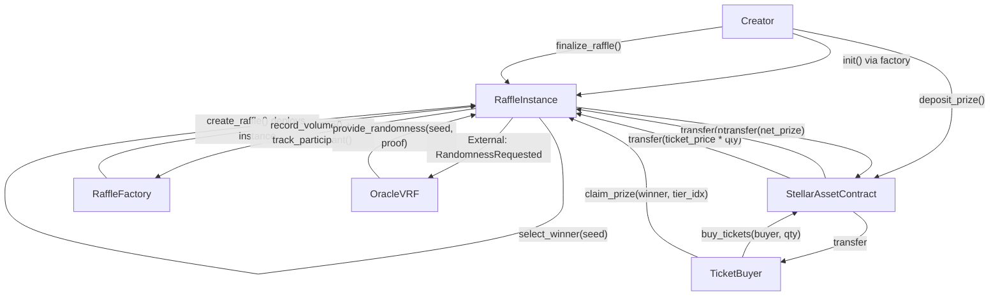

# Tikka - Decentralized Raffle Platform

> ⚠️ **CRITICAL: PRE-AUDIT & NOT PRODUCTION-READY**
>
> This codebase is **pre-audit**. No security audit, formal verification, or
> bug bounty has been performed. The contracts contain in-progress feature
> stubs, known TTL gaps (see DEVELOPMENT.md), and a low-stakes-only PRNG
> winner selection path. **DO NOT DEPLOY ON STELLAR MAINNET OR ESCROW
> HIGH-VALUE ASSETS.**
>
> Use this software only on isolated test networks and only with test
> tokens. Any on-chain deployment today carries a high risk of total loss
> of funds, stuck raffles, or manipulated draws. See the Feature Status
> Table below to understand exactly what is and is not wired up.


## 🎯 What is Tikka?

Tikka is a decentralized raffle platform built on Stellar using Soroban smart contracts. Users can create raffles, sell tickets priced in Stellar assets, and distribute prizes securely on-chain.

---

## 🚦 Feature Status Table

**Authoritative status.** Anything not marked **Shipped** is either stub code,
has no test coverage, or does not exist yet. Refer to `docs/` for design
specs of In Progress / Planned items.

| Feature | Status | Notes |
|---|---|---|
| Factory contract (raffle deployment, admin, pagination) | **Shipped** | See `contracts/raffle/src/lib.rs` |
| Instance contract (lifecycle FSM: create → deposit → buy → finalize → claim) | **Shipped** | See `contracts/raffle-instance/src/lib.rs` |
| Prize escrow (creator deposits before ticket sales open) | **Shipped** | Explicit `PendingPrize → Active` status transition |
| Internal PRNG winner selection (low-stakes only) | **Shipped** | Uses `env.prng()` + multi-source seed; NOT high-stakes-safe |
| External VRF winner selection (oracle path) | **Shipped** | `provide_randomness` entrypoint with ed25519 proof + request ID replay guard |
| Oracle randomness fallback & timeout | **Shipped** | `trigger_randomness_fallback` after ~200 ledgers |
| Multi-prize tiers (basis-point split) | **Shipped** | `Raffle.prizes` + `calculate_tier_prize` |
| Raffle status FSM + `status_changed` events | **Shipped** | 8 states, documented in EVENTS.md |
| Claim lockup (configurable post-finalization delay) | **Shipped** | 0 → 7 day range, default 1 h |
| Per-ticket refund after cancel / fail | **Shipped** | `refund_ticket` + `TicketRefunded` idempotency key |
| Protocol fees (bp) + treasury sweep | **Shipped** | `withdraw_fees` + accumulator key |
| Factory pause / instance pause / whitelist | **Shipped** | Admin-only, synced from factory → instance |
| Timelocked factory admin ops (48 h) | **Shipped** | `set_config` → `execute_config_change` |
| State checkpoints & aggregate stats | **Shipped** | Every 1,000 raffles |
| `#[contracterror]` enums + ERRORS.md index | **Shipped** | — |
| Event catalog + EVENTS.md index | **Shipped** | — |
| Storage tier map + STORAGE.md TTL reference | **Shipped** | — |
| Draw attestation (signed draw receipt for off-chain verifiers) | ❌ **Planned** | No code; see `.kiro/specs/` drafts |
| Quorum / threshold randomness (multi-oracle) | ❌ **Planned** | Only single oracle supported today |
| Unique winners (no same address wins two tiers in one draw) | ❌ **Planned** | Current `OracleSeedWinnerSelection` allows repeat addresses across tiers |
| Per-address ticket caps (max N tickets per buyer) | ❌ **Planned** | Only `allow_multiple=true/false` is implemented today |
| Bundle pricing (discount for buying qty > 1 tickets) | ❌ **Planned** | `buy_tickets(qty)` charges `qty * ticket_price` always |
| Early-bird / time-dependent discounts | ❌ **Planned** | Flat price model only |
| Off-chain oracle service (VRF signer + tx submitter) | 🚧 **In Progress** | Directory exists at `oracle/src/` with TypeScript service stubs — no executable entrypoint yet; package.json has build but no runtime index |
| Automatic TTL extension bot / on-chain bump | ❌ **Planned** | **All TTL is operator-responsibility today;** see DEVELOPMENT.md risks table |
| Batch ticket refunds (sweep all for a cancelled raffle) | ❌ **Planned** | Only per-ticket `refund_ticket(id)` exists; no bulk API |
| Admin cancel execution path (force cancel from factory admin) | ❌ **Planned** | `cancel_raffle(reason=AdminCancelled)` exists as a branch but has no factory-level orchestration |
| Metadata updates (metadata_hash change post-creation) | ❌ **Planned** | Hash is immutable after `init`; no update entrypoint |
| "My Tickets" per-buyer paginated query endpoint | ❌ **Planned** | No `get_tickets_for_buyer(buyer)` read function; only `Ticket(u32)` K/V lookups |

### Current priority track

Active work is tracked under the **`[BUILD]`** issue labels in the repository:

- `[BUILD] oracle-service` — wire the oracle TS service end-to-end (polls, signs, submits `provide_randomness`)
- `[BUILD] ttl-bot` — automatic off-chain TTL extension for factory + live instances
- `[BUILD] unique-winners` — reject tier repeats in winner selection
- `[BUILD] per-address-ticket-caps` — `max_per_buyer` raffle config field

See the `docs/` folder for the authoritative references before relying on
any feature.

---

## 🚀 Key Features (Shipped)

### **🎲 On-Chain Winner Selection**

-   Internal draws use a multi-source seed derived from ledger timestamp,
    ledger sequence, the raffle's own address, and ticket count.
-   Deterministic replay for identical raffle and ledger inputs.
-   **Intended for low-stakes raffles only.** High-stakes draws **must**
    use the oracle VRF path (`RandomnessSource::External` +
    `provide_randomness`).

### **💰 Token-Based Tickets and Prizes**

-   **Ticket Purchases**: Any Stellar asset contract.
-   **Prizes**: Same asset used for ticket purchases.
-   **Flexible Pricing**: Set ticket prices and prize amount per raffle.

### **🔒 Escrowed Prizes**

-   Prizes are held in the smart contract until finalization.
-   Winners claim prizes after the raffle ends + claim lockup elapses.

### **📊 Basic Raffle Analytics**

-   Total tickets sold per raffle.
-   Winner tracking and claim status per tier.

---

## 🏗️ How Tikka Works

### **1. Raffle Creation**

```
Creator → Create Raffle → Set Parameters
```

-   Raffle creators specify via `RaffleConfig`:
    -   Description, `metadata_hash` (immutable), end time, `no_deadline` flag
    -   Maximum and minimum ticket count
    -   Ticket price and payment asset (Stellar Asset Contract)
    -   `allow_multiple` — allow the same buyer more than one ticket
    -   Prize amount and per-tier basis-point split (`prizes: Vec<u32>` sum to 10000 bp)
    -   Randomness source: `Internal` or `External` + oracle address
    -   Claim lockup seconds

### **2. Prize Escrow**

```
Creator → deposit_prize() → Contract Escrow  +  status: PendingPrize → Active
```

-   Prizes are transferred to the smart contract.
-   The raffle transitions explicitly from `PendingPrize → Active` on
    successful deposit; no tickets can be purchased before this step.

### **3. Ticket Sales**

```
Participants → buy_tickets(buyer, quantity) → Validation → Ticket Issuance
```

-   Users purchase tickets with the raffle payment asset.
-   Contract validates transfer, mints ticket IDs, records per-buyer counts,
    and routes protocol fees to the treasury.
-   When `tickets_sold == max_tickets` the raffle auto-transitions to
    `Drawing`.

### **4. Winner Selection**

```
Raffle Ends → finalize_raffle() → (Internal) PRNG draw
                                → (External) Oracle VRF request → provide_randomness()
```

-   Creator invokes `finalize_raffle()` once the end_time is reached or
    max_tickets sold.
-   Zero tickets or below `min_tickets` → rafle auto-fails (refund path).
-   External path: an oracle delivers a signed seed to
    `provide_randomness(seed, pubkey, proof, request_id)`.

### **5. Prize Distribution**

```
Winner Selected → claim_prize(winner, tier_index)
```

-   Each tier's winner claims their portion after the claim lockup delay.
-   Net prize after protocol fees is transferred; remaining unclaimed prizes
    are accessible via the `emergency_withdraw` route after 90 days.

### **Raffle Flow Diagram**


```mermaid
flowchart TD
    Creator[Creator]
    Buyer[TicketBuyer]
    Token[StellarAssetContract]
    Factory[RaffleFactory]
    Raffle[RaffleInstance]
    Oracle[OracleVRF]

    Factory -->|"create_raffle() deploys instance"| Raffle
    Creator -->|"init() via factory"| Raffle
    Creator -->|"deposit_prize()"| Token
    Token -->|"transfer(prize)"| Raffle

    Buyer -->|"buy_tickets(buyer, qty)"| Token
    Token -->|"transfer(ticket_price * qty)"| Raffle
    Raffle -->|"record_volume() + track_participant()"| Factory

    Creator -->|"finalize_raffle()"| Raffle
    Raffle -->|"External: RandomnessRequested"| Oracle
    Oracle -->|"provide_randomness(seed, proof)"| Raffle
    Raffle -->|"select_winner(seed)"| Raffle

    Buyer -->|"claim_prize(winner, tier_idx)"| Raffle
    Raffle -->|"transfer(net_prize)"| Token
    Token -->|transfer| Buyer
```

---

## 🔧 Technical Architecture

### **Smart Contract Stack**

-   **Soroban (Rust)**: Smart contract implementation
-   **Stellar**: Network and asset contracts

### **Core Contracts**

#### **`contracts/raffle/src/lib.rs` → `raffle-factory` crate**

```rust
pub fn init_factory(env: Env, admin: Address, wasm_hash: BytesN<32>, protocol_fee_bp: u32, treasury: Address) -> Result<(), ContractError>;
pub fn create_raffle(env: Env, creator: Address, config: RaffleConfig) -> Result<Address, ContractError>;
pub fn get_raffles_page(env: Env, params: PaginationParams) -> PageResultRaffles;
```

#### **`contracts/raffle-instance/src/lib.rs` → `raffle-instance` crate**

```rust
pub fn init(env: Env, factory: Address, admin: Address, creator: Address, config: RaffleConfig) -> Result<(), Error>;
pub fn deposit_prize(env: Env) -> Result<(), Error>;
pub fn buy_tickets(env: Env, buyer: Address, quantity: u32) -> Result<u32, Error>;
pub fn finalize_raffle(env: Env) -> Result<(), Error>;
pub fn provide_randomness(env: Env, random_seed: u64, public_key: BytesN<32>, proof: BytesN<64>, request_id: u64) -> Result<Address, Error>;
pub fn claim_prize(env: Env, winner: Address, tier_index: u32) -> Result<i128, Error>;
pub fn cancel_raffle(env: Env, reason: CancelReason) -> Result<(), Error>;
pub fn refund_ticket(env: Env, ticket_id: u32) -> Result<i128, Error>;
pub fn get_raffle(env: Env) -> Result<Raffle, Error>;
```

### **Data Structures**

```rust
pub struct Raffle {
    pub creator: Address,
    pub payment_token: Address,
    pub treasury_address: Option<Address>,
    pub description: String,
    pub end_time: u64,
    pub no_deadline: bool,
    pub max_tickets: u32,
    pub min_tickets: u32,
    pub allow_multiple: bool,
    pub ticket_price: i128,
    pub prize_amount: i128,
    pub prizes: Vec<u32>,
    pub tickets_sold: u32,
    pub status: RaffleStatus,
    pub prize_deposited: bool,
    pub winners: Vec<Address>,
    pub claimed_winners: Vec<bool>,
    pub randomness_source: RandomnessSource,
    pub oracle_address: Option<Address>,
    pub protocol_fee_bp: u32,
    pub swap_router: Option<Address>,
    pub tikka_token: Option<Address>,
    pub finalized_at: Option<u64>,
    pub winner_ticket_id: Option<u32>,
    pub claim_lockup_seconds: u64,
}
```

### **Contract Constraints (as shipped)**

-   Multiple winner tiers (1 tier → `prizes = [10000]`; multi-tier `prizes` sum = 10000)
-   Prize and ticket payments use the same Stellar asset
-   Internal PRNG is suitable for low-stakes raffles only (e.g. sub-500 XLM prizes)
-   For high-stakes raffles, prefer the external oracle/VRF randomness path

---

## 🔒 Metadata Integrity (metadata_hash)

Every raffle requires a `metadata_hash: BytesN<32>` — a SHA-256 hash of the off-chain metadata JSON stored on IPFS. This hash is committed on-chain at creation and is **immutable** (no metadata update API exists today — see Planned feature above).

### Metadata JSON format

```json
{
  "name": "My Raffle",
  "description": "Full rules and description here",
  "image": "ipfs://Qm...",
  "rules": "..."
}
```

### Generating the hash

**Linux / macOS**

```bash
# 1. Create your metadata file
cat > metadata.json << 'EOF'
{"name":"My Raffle","description":"...","image":"ipfs://Qm...","rules":"..."}
EOF

# 2. Hash it (outputs hex)
sha256sum metadata.json
# or on macOS:
shasum -a 256 metadata.json
```

**Node.js**

```js
const crypto = require("crypto");
const fs = require("fs");
const hash = crypto
  .createHash("sha256")
  .update(fs.readFileSync("metadata.json"))
  .digest("hex");
console.log(hash); // 64-char hex string → 32 bytes
```

**Python**

```python
import hashlib, json

meta = {"name": "My Raffle", "description": "...", "image": "ipfs://Qm...", "rules": "..."}
# Use compact, sorted JSON for reproducibility
raw = json.dumps(meta, separators=(',', ':'), sort_keys=True).encode()
print(hashlib.sha256(raw).hexdigest())
```

### Converting hex → `BytesN<32>` for the contract call

```bash
# Stellar CLI example — pass as a hex-encoded bytes argument
stellar contract invoke ... -- \
  --metadata_hash "$(sha256sum metadata.json | cut -d' ' -f1)"
```

> **Important:** Use a canonical JSON serialization (compact, keys sorted) so the hash is reproducible by anyone who downloads the metadata from IPFS.

---

### **Stellar Testnet**

-   **Contract Address**: `CCTCPMI66REXIJQPVOPNTNUZBCMSRM7TZLMIPQROZIID44XNP2P2MKFZ`

---

## 🚀 Getting Started

### **Prerequisites**

-   Rust toolchain (`rust-toolchain.toml` pins the exact version) + `wasm32v1-none` target
-   Stellar CLI (optional for deployment)

### **Run Tests**

```bash
# Recommended workspace-wide (this is what CI runs)
cargo test --workspace

# Per crate when you're iterating on a specific contract:
cargo test -p raffle-factory
cargo test -p raffle-instance
cargo test -p raffle-shared
```

### **Build the Contract**

```bash
# Both contracts via the workspace build:
cargo build --target wasm32v1-none --release -p raffle-instance -p raffle-factory
```

The compiled WASM binaries live at:

-   `target/wasm32v1-none/release/raffle_factory.wasm`
-   `target/wasm32v1-none/release/raffle_instance.wasm`

---

## 🛠️ Development

For local setup, build, test, and the critical TTL management readme, see
`DEVELOPMENT.md`.  For the crate & module map and new-code placement
rules, see `docs/ARCHITECTURE.md` and `CONTRIBUTING.md`.

**`docs/` is the authoritative source for contract APIs, events, error
codes, storage/TTL semantics, and deployment process.**

-   `docs/ARCHITECTURE.md` — crate map, dependency graph, decision tree
-   `docs/ERRORS.md` — all error discriminants + frontend mapping
-   `docs/EVENTS.md` — every event, its topics, fields, indexer notes
-   `docs/STORAGE.md` — `DataKey → Tier → TTL risk → bump schedule`
-   `docs/DEPLOYMENT.md` — toolchain pinning, WASM verification, change process

## 🤝 Contributing

See `CONTRIBUTING.md` for contribution guidelines, the mandatory `make ci`
pre-push command, and the "Where does my code go?" code placement rules.

## 📚 Documentation

-   **Stellar Soroban**: https://developers.stellar.org/docs/build/smart-contracts/overview
-   **Soroban Examples**: https://github.com/stellar/soroban-examples
-   **Project docs index**: `docs/README.md`

## 📄 License

This project is licensed under the MIT License - see the [LICENSE](LICENSE) file for details.

## 🆘 Support

-   **Documentation**: Start with `docs/` → then DEVELOPMENT.md → then README.
-   **Issues**: Report bugs and feature requests in the repository issue
    tracker. Please include `make ci` output, the commit hash, and which
    network you're testing on.

---

**Built with ❤️ on Stellar. Not audited. Do not use with real funds.**
