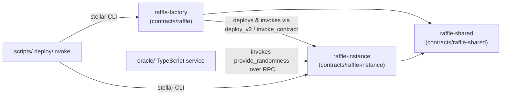

# Architecture

This document maps every crate, module, and top-level directory in the `tikka-contracts` workspace. Use it as the authoritative reference for deciding where new code belongs (see also the placement table in `CONTRIBUTING.md`).

## Workspace Overview

```
tikka-contracts/
├── contracts/                   ← Soroban smart contract crates (Rust, no_std)
│   ├── raffle/                  ← Factory contract (crate: raffle-factory)
│   ├── raffle-instance/         ← Per-raffle instance contract
│   └── raffle-shared/           ← Shared types consumed by both crates
├── oracle/                      ← Off-chain TypeScript VRF oracle service
├── fuzz/                        ← cargo-fuzz targets for contract invariants
├── scripts/                     ← Deploy / invoke / verify shell scripts
├── deployments/                 ← Recorded on-chain deployments
└── docs/                        ← Human-readable architecture & reference docs
```

## Crate Map

### `contracts/raffle` → `raffle-factory` crate (cdylib + rlib)

The **Factory** is a singleton Soroban contract that:
- Owns protocol-level admin, fees, and treasury config
- Deploys and tracks every `RaffleInstance` contract via `deploy_v2`
- Records aggregate statistics (participants, volumes, checkpoints)
- Provides paginated listing of all raffles
- Syncs admin/pause state into individual raffle instances

| Module / File | Responsibility |
|---|---|
| [`lib.rs`](file:///c:/Users/USA/Documents/Osuocha/tikka-contracts/contracts/raffle/src/lib.rs) | Top-level crate: declares `#![no_std]`, `DataKey` enum, `ContractError`, `RaffleFactory` `#[contract]`, plus the `#[contractimpl]` block with all factory entrypoints. Also contains inline `#[cfg(test)]` tests. **Note:** tests should be migrated to `src/tests/` per the CONTRIBUTING.md rules. |
| [`events.rs`](file:///c:/Users/USA/Documents/Osuocha/tikka-contracts/contracts/raffle/src/events.rs) | All factory-scoped `#[contractevent]` structs: initialization, admin ops, pause, checkpoints, cleanup. Each struct also carries a `publish(&Env)` helper. |

Key `DataKey` storage tiers:
- **Instance tier**: `Paused` – accessed on every guarded call, lives/falls with the instance TTL.
- **Persistent tier**: `Admin`, `RaffleInstances`, `InstanceWasmHash`, `ProtocolFeeBP`, `Treasury`, `PendingAdmin`, `PendingOp`, `OpCounter`, `Checkpoint`, `LatestCheckpointIndex`, `TotalRafflesCreated`, `UniqueParticipant`, `TotalUniqueParticipants`, `MinCreationDelay`, `LastCreationTime`, `WhitelistedPartner`, `TotalVolumePerAsset`, `RaffleInstancesCount` – each needs independent TTL bumps (see `docs/STORAGE.md`).

### `contracts/raffle-instance` → `raffle-instance` crate (cdylib + rlib)

Each **Raffle Instance** is a dedicated Soroban contract deployed by the factory. Instances are stateless from the factory's POV — every piece of per-raffle state lives inside its own `Instance` and `Persistent` storage entries.

| Module / File | Responsibility |
|---|---|
| [`lib.rs`](file:///c:/Users/USA/Documents/Osuocha/tikka-contracts/contracts/raffle-instance/src/lib.rs) | `#![no_std]` root. Declares `DataKey`, `Error` enum, `Raffle` struct, `FairnessMetadata`, the `Contract` contract shell, and the big `#[contractimpl]` containing: `init`, `deposit_prize`, `buy_tickets`, `finalize_raffle`, `provide_randomness`, `trigger_randomness_fallback`, `claim_prize`, `cancel_raffle`, `refund_prize`, `refund_ticket`, `emergency_withdraw`, `pause`, `unpause`, `set_admin`, `update_oracle_address`, `set_protocol_fee_bp`, `rescue_tokens`, read-only queries, and `do_finalize_with_seed` helper. Also contains inline tests. **Note:** tests should be extracted to `src/tests/`; the inline test module violates the ~600-line ceiling. |
| [`events.rs`](file:///c:/Users/USA/Documents/Osuocha/tikka-contracts/contracts/raffle-instance/src/events.rs) | Instance lifecycle events: `RaffleCreated`, `PrizeDeposited`, `TicketPurchased`, `DrawTriggered`, `RaffleFinalized`, `WinnerDrawn`, `RaffleCancelled`, `PrizeClaimed`, `TicketRefunded`, `RaffleStatusChanged`, `FeesWithdrawn`, `OracleAddressUpdated`, `ProtocolFeeUpdated`, `EmergencyWithdrawn`, `TokensRescued`, pause/unpause, oracle flow (`RandomnessRequested`, `RandomnessReceived`, `RandomnessFallbackTriggered`). |
| [`randomness.rs`](file:///c:/Users/USA/Documents/Osuocha/tikka-contracts/contracts/raffle-instance/src/randomness.rs) | Winner selection strategies. `WinnerSelectionStrategy` trait, `PrngWinnerSelection` (internal PRNG path, low-stakes only), and `OracleSeedWinnerSelection` (VRF-seeded path with rejection-sampling modulo-bias elimination). Also `build_internal_seed` which hashes ledger + raffle entropy. Unit tests live inline. |
| [`test.rs`](file:///c:/Users/USA/Documents/Osuocha/tikka-contracts/contracts/raffle-instance/src/test.rs) | Dedicated integration tests: oracle fallback with ledger delays, admin oracle address updates, admin protocol-fee updates before sales, admin fee withdrawal through the claim flow. |

### `contracts/raffle-shared` → `raffle-shared` crate (rlib only, no cdylib)

The glue crate: **every type, enum, or constant shared between the factory and instance crates lives here.** Never duplicate a type — if both crates need it, promote it to `raffle-shared`.

| Module / File | Responsibility |
|---|---|
| [`lib.rs`](file:///c:/Users/USA/Documents/Osuocha/tikka-contracts/contracts/raffle-shared/src/lib.rs) | `#![no_std]` root. Declares `RaffleStatus`, `CancelReason`, `RandomnessSource`, `RandomnessType` enums; `RaffleConfig`, `Ticket`, `FairnessData`, `PaginationParams`, `PageResultRaffles`, `PageResultTickets`, `AdminOp`, `RandomnessRequest` structs; `DEFAULT_PAGE_LIMIT`/`MAX_PAGE_LIMIT`; `effective_limit` helper; and the `RandomnessOracleTrait` / `RandomnessReceiverTrait` client traits for cross-contract calls. |
| `constants.rs` | **New constants live here** (file was added as part of this refactor). All magic numbers, fee bounds, page limits, timelock durations, security thresholds — never again inline a tunable value. |

## Off-chain / Non-Contract Map

### `oracle/` – TypeScript VRF Oracle Service

Mirror of the Rust crate layout:

| Directory | Responsibility |
|---|---|
| `src/keys/` | Ed25519 key management for oracle signing (private key loading, key rotation hooks). |
| `src/tx/` | Transaction submission: building Soroban operations, fee bumping, retry logic. |
| `src/vrf/` | VRF verification wrapper: verifies the off-chain random seed proof before `provide_randomness` is called. |

### `fuzz/` – `cargo-fuzz` targets

Runs the libfuzzer engine against high-risk entrypoints:

| Target | Focus |
|---|---|
| `fuzz_buy_ticket.rs` | Invariant fuzzing for `buy_tickets`: ticket count accounting, fee calculation overflow, min/max bounds. |
| `fuzz_finalize_raffle.rs` | Draw correctness under adversarial inputs: 0 tickets, more prizes than tickets, seed=0, extreme winner counts. |

### `scripts/` – Shell Utilities

| Script | Purpose |
|---|---|
| `deploy-testnet.sh` / `deploy-mainnet.sh` | Compile WASM + deploy factory to the target network. Records the resulting address in `deployments/`. |
| `fund-testnet.sh` | Friendbot funding wrapper. |
| `invoke.sh` | Convenience wrapper around `stellar contract invoke` for the deployed factory. |
| `verify.sh` | Downloads on-chain WASM bytecode, computes SHA-256, and diffs it against the local build for determinism verification. |

## Dependency Graph (high-level)



## New-module decision tree

When you want to add a feature:

1. Is it on-chain logic? → Choose between `raffle-factory` (protocol-wide), `raffle-instance` (per-raffle), or `raffle-shared` (shared types).
2. Will the feature grow beyond ~300 lines? → Split a `mod.rs` / `topic.rs` file rather than appending to `lib.rs`.
3. Does it introduce a new storage key, event, error, or constant? → Update the corresponding doc in `docs/` **in the same PR**.
4. Does it introduce cross-contract calls? → Define the trait in `raffle-shared/src/lib.rs` and implement on the client side.
5. Is it off-chain tooling? → `oracle/` for live services, `scripts/` for one-off ops.

See `CONTRIBUTING.md#where-does-my-code-go` for the rules table, and `docs/STORAGE.md` for the complete key→tier mapping with TTL impact.
