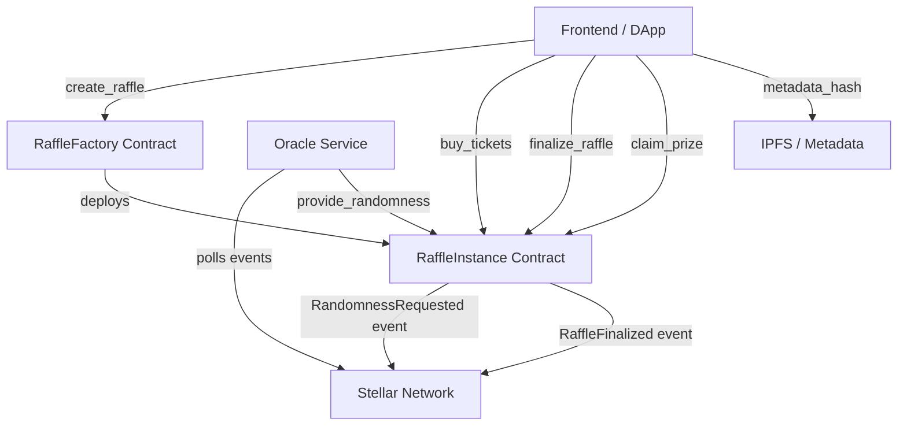
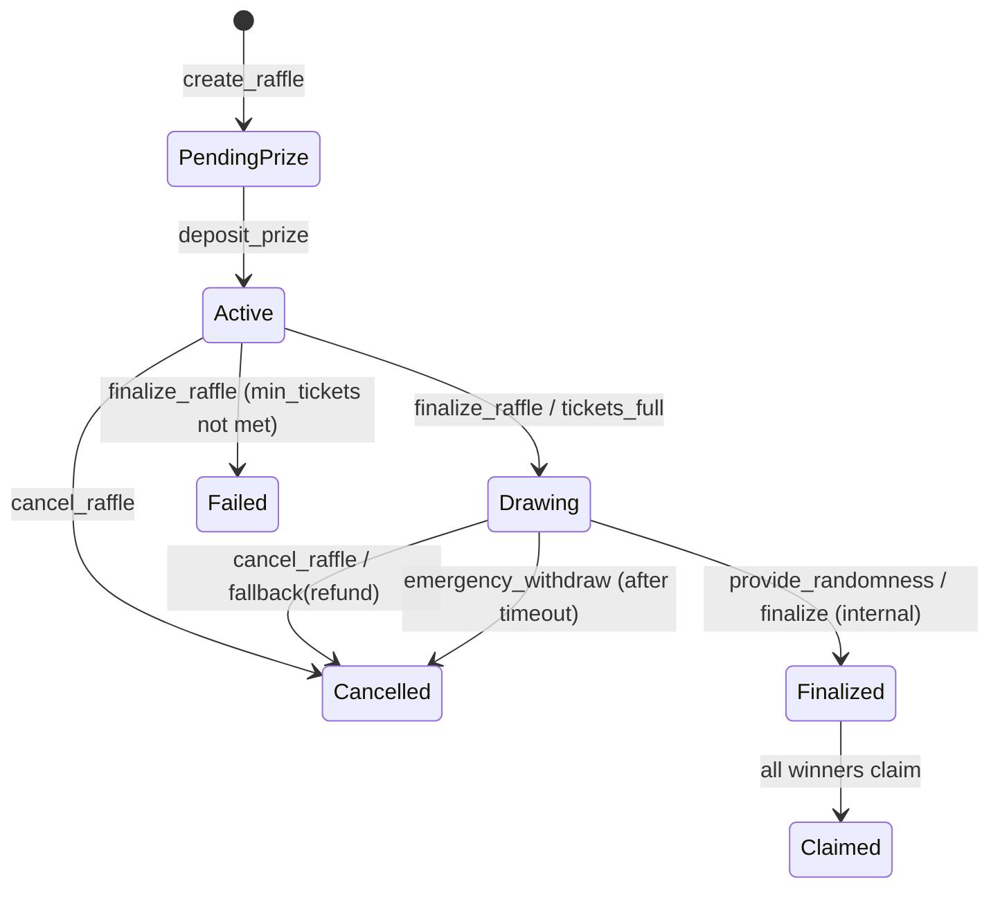

# Tikka Architecture

This document explains how the factory, raffle instances, oracle, and clients interact.

## Factory -> Instance -> Oracle Flow


```mermaid
graph TB
    UI[Frontend / DApp]
    Factory[RaffleFactory Contract]
    Instance[RaffleInstance Contract]
    Oracle[Oracle Service]
    Stellar[Stellar Network]
    IPFS[IPFS / Metadata]

    UI -->|create_raffle| Factory
    Factory -->|deploys| Instance
    UI -->|buy_tickets| Instance
    UI -->|finalize_raffle| Instance
    Instance -->|RandomnessRequested event| Stellar
    Oracle -->|polls events| Stellar
    Oracle -->|provide_randomness| Instance
    Instance -->|RaffleFinalized event| Stellar
    UI -->|claim_prize| Instance
    UI -->|metadata_hash| IPFS
```

### Flow explanation

1. A creator calls `create_raffle` on the factory with `RaffleConfig`.
1. The factory deploys a new raffle instance and returns the new instance address.
1. Users buy tickets directly on the raffle instance contract.
1. When finalization starts, the instance emits randomness request events to the network.
1. The oracle service polls those events and calls `provide_randomness` back on the instance.
1. The instance finalizes winners, emits finalization events, and winners claim prizes.

## Crate and Module Map

Every directory below lists each crate, its top-level responsibility, and a one-line
responsibility for each submodule. `lib.rs` in each contract crate is intentionally a
delegation-only root; the real logic lives in the named submodules.

### Rust Workspace (`Cargo.toml`)

| Crate | Root file | Responsibility |
|-------|-----------|----------------|
| `raffle-factory` | `contracts/raffle-factory/src/lib.rs` | Factory contract: deploys instances, manages registry, timelocked governance, creator profiles, global pausing. |
| `raffle-instance` | `contracts/raffle-instance/src/lib.rs` | Per-raffle instance contract: ticket sales, draw execution, claims, refunds, randomness integration. |
| `raffle-shared` | `contracts/raffle-shared/src/lib.rs` | Types shared across factory and instance: config, enums, pagination, macro helpers, constants. |
| `raffle-fuzz` | `fuzz/Cargo.toml` | `cargo-fuzz targets for lifecycle, ticket purchase, draw, refund, commit-reveal harnesses. Not part of the default workspace members. |

#### `contracts/raffle-factory/src/`

| File | Responsibility |
|------|----------------|
| `lib.rs` | Crate root. Declares `RaffleFactory contract, `DataKey` storage keys, `ContractError` enum, `PendingOp` timelock struct, `StateCheckpoint`, entrypoint delegations to submodules. |
| `events.rs` | `#[contractevent]` structs published by the factory: `FactoryInitialized`, `AdminOpProposed`, `ContractPaused`, `CheckpointCreated`, `RecurringRaffleCreated`, and all registry events. |
| `views.rs` | Read-only query surface: `get_raffles_page`, `get_raffles_by_creator`, `get_raffles_by_category`, `get_protocol_stats`, `get_pending_op`, pagination helpers. |
| `registry.rs` | Creator profiles (`CreatorProfile`), partner leaderboard stats, partner whitelisting, rate limiting. |
| `tests/mod.rs` | Integration test harness. |
| `tests/budget.rs` | Gas/instruction budget tests. |
| `tests/views.rs` | View/pagination tests. |
| `tests/governance.rs` | Timelock and admin-operation tests. |

#### `contracts/raffle-instance/src/`

| File | Responsibility |
|------|----------------|
| `lib.rs` | Crate root. Declares `RaffleInstance` contract, `DataKey`, `Error` enum, `Raffle` struct, `Winner`, entrypoint delegations to submodules. |
| `admin.rs` | Admin-only entrypoints: `pause`, `unpause`, `cancel_raffle`, `withdraw_fees`, `emergency_withdraw`, `rescue_tokens`, `sweep_dust`, `wipe_storage`, oracle+fee+metadata updates, ticket-sales pause. |
| `attestation.rs` | `get_draw_attestation` package: bundles fairness data, metadata hash, winner list, winning ticket IDs, randomness source, effective-config hash for third-party verifiers. |
| `claim.rs` | `claim_prize`, `sweep_unclaimed`, `refund_prize`, `refund_ticket`, `batch_refund_tickets` paths with entitlement + solvency checks. |
| `draw.rs` | `finalize_raffle` (Internal/External/CommitReveal/Quorum), `provide_randomness` with VRF verify, `provide_quorum_randomness`, `trigger_randomness_fallback` paths, winner selection, fairness emission. |
| `events.rs` | Instance `#[contractevent]` structs: `RaffleCreated`, `TicketPurchased`, `RandomnessRequested`, `RaffleFinalized`, `WinnerDrawn`, `PrizeClaimed`, all lifecycle events. |
| `helpers.rs` | Internal shared helpers: `Guard` reentrancy guard, `read_raffle` / `write_raffle`, solvency assertions, `transition_status`, `do_finalize_with_seed`, oracle randomness request, admin/auth helpers. |
| `init.rs` | Instance `init` entrypoint and `deposit_prize` validation. |
| `randomness.rs` | `build_vrf_proof_message`, VRF verification, quorum seed aggregation (`aggregate_quorum_seeds`). |
| `tickets.rs` | `buy_tickets`, `buy_tickets_for`, `submit_commit` commit-reveal commits, NFT ticket hooks, bundle pricing logic. |
| `views.rs` | Read-only instance queries: `get_raffle`, `get_stats`, `get_fairness_data`, `get_my_tickets`, `preview_buy`, `get_remaining_ticket_allowance`, pause flags. |
| `test.rs` | Test-only utilities. |
| `tests/` | Integration tests per concern (admin, budget, claim, claim_state, draw, fairness, init, invariants, tickets, ttl). |

#### `contracts/raffle-shared/src/`

| File | Responsibility |
|------|----------------|
| `lib.rs` | Crate root. Shared structs + enums: `RaffleConfig`, `RaffleStatus`, `RandomnessSource`, `RandomnessType`, `CancelReason`, `FailureReason`, `Ticket`, `Winner`, `FairnessData`, pagination types (`PaginationParams`, `PageResultRaffles`, `PageResultTickets`), client traits for oracle/NFT/randomness contracts, `impl_require_admin!` / `impl_require_not_paused!` macros. |
| `constants.rs` | Single source of truth for protocol magic numbers: ticket/pricing/description limits, timing, timelock, TTL, page defaults, randomness cap. |
| `errors.rs` | Shared `ProtocolError` and error-range policy documentation. |
| `events.rs` | Shared event structs reused across factory+instance contracts. |
| `config_builder.rs` | `RaffleConfig` builder/helpers. |
| `nft_mint_test.rs` | NFT mint success/failure-path test harness. |

### TypeScript Oracle Service (`oracle/`)

Each directory under `oracle/src/` holds a focused responsibility with its
own tests.

| Directory | Responsibility |
|-----------|----------------|
| `alert/` | Alerter service for pipeline and alert routing. |
| `deduplication/` | Request deduplication store preventing double-submission. |
| `health/` | Health check HTTP server + health probe logic. |
| `keys/` | Oracle secret-key management, service abstraction. |
| `listener/` | Stellar ledger event listener, checkpoint persistence. |
| `logging/` | Structured pino logger setup. |
| `metrics/` | Prometheus-style metrics surface. |
| `queue/` | Randomness-request queue, dead-letter store, fatal-error handlers. |
| `quorum/` | k-of-N oracle quorum aggregation for Quorum randomness mode. |
| `shutdown/` | Graceful-shutdown controller for all long-running tasks. |
| `tx/` | Stellar TX submitter with retry policy. |
| `vrf/` | VRF proof-message construction + service. |
| `config.ts` | Load/validate runtime configuration. |
| `index.ts` | Service entrypoint wiring all components together. |
| `pipeline.ts` | Core request pipeline from event → VRF → submit. |

### Scripts & Tooling

| Path | Responsibility |
|------|----------------|
| `scripts/build-reproducible.sh` | Deterministic WASM build + SHA-256 output. |
| `scripts/deploy-testnet.sh` / `deploy-mainnet.sh` | Full deploy sequences with WASM install → init → verify → registry write. |
| `scripts/invoke.sh` | Thin `stellar contract invoke` wrapper. |
| `scripts/verify.sh` | On-chain WASM hash vs local artifact comparison. |
| `scripts/fund-testnet.sh` | Friendbot funding helper. |
| `scripts/smoke-test.sh` | End-to-end testnet lifecycle smoke test. |
| `scripts/check_error_codes.py` | Checks discriminant uniqueness across the protocol enums. |
| `scripts/check_wasm_sizes.py` | 128KB WASM size cap + baseline delta check. |
| `scripts/check_coverage_ratchet.py` | Coverage non-regression (ratchet). |
| `scripts/check_orphan_modules.py` | Detects `mod x;` with no file. |
| `scripts/generate_error_docs.py` | Regenerates `docs/ERRORS.md` from `#[contracterror]` enums. |
| `scripts/generate_event_docs.py` | Regenerates `docs/EVENTS.md` from `#[contractevent]` structs. |
| `baselines/wasm_sizes.json` | Committed WASM size baseline for delta check. |
| `coverage/coverage-ratchet.json` | Committed line-coverage ratchet baseline. |

## RaffleStatus State Machine


```mermaid
stateDiagram-v2
    [*] --> PendingPrize: create_raffle
    PendingPrize --> Active: deposit_prize
    Active --> Drawing: finalize_raffle / tickets_full
    Active --> Cancelled: cancel_raffle
    Active --> Failed: finalize_raffle (min_tickets not met)
    Drawing --> Finalized: provide_randomness / finalize (internal)
    Drawing --> Cancelled: cancel_raffle / fallback(refund)
    Finalized --> Claimed: all winners claim
    Drawing --> Cancelled: emergency_withdraw (after timeout)
```

### State notes

- `PendingPrize`: created but not funded yet.
- `Active`: funded and selling tickets.
- `Drawing`: draw execution in progress.
- `Finalized`: winners are locked and can claim.
- `Claimed`: terminal state when all claims are complete.
- `Cancelled` / `Failed`: terminal non-success states.

### Token egress and escrow solvency

The instance has four intended token-moving paths:

- `claim_prize` pays each unclaimed winner and records protocol fees.
- `sweep_unclaimed` pays unclaimed prizes to the treasury after the claim
    expiry period and marks those prizes claimed.
- `refund_prize` returns the deposited prize after `Cancelled` or `Failed`.
- `refund_ticket` returns each ticket payment after `Cancelled` or `Failed`.
- `withdraw_fees` pays only recorded accumulated fees after finalization.

Administrative escape paths are constrained by the same invariant:

- `emergency_withdraw` is only available for a timed-out `Drawing` raffle.
    Its delay starts at `end_time`, or at the randomness request ledger for a
    no-deadline raffle. It transfers only the deposited prize token and leaves
    all remaining obligations covered.
- `rescue_tokens` can transfer unrelated-token surplus, but for either
    configured raffle token it must leave unpaid ticket refunds, accumulated
    fees, and outstanding prize claims fully covered.
- `sweep_dust` is available only after settlement and transfers payment-token
    surplus above all remaining entitlements; accumulated fees are preserved.

Escrow solvency is a protocol guarantee. After every successful state-changing
entrypoint, configured-token balances must cover all stored entitlements:

```text
balance(prize_token)   >= unclaimed_prize_total
balance(payment_token) >= unrefunded_ticket_total + accumulated_fees_owed
```

When `payment_token == prize_token`, these are enforced as one combined
inequality over the shared token balance. `unclaimed_prize_total`,
`unrefunded_ticket_total`, and `accumulated_fees_owed` are derived from
contract storage, not off-chain indexer state or test bookkeeping.

No token-moving path may reduce a token balance below its outstanding
entitlement. `emergency_withdraw` cannot operate on `Finalized`, because
unclaimed winners remain entitled to their prizes.

### Entrypoint Lifecycle Transition Matrix

The following table summarizes the behavior of mutating contract entrypoints across all 7 `RaffleStatus` states (#623):

| Mutating Entrypoint | PendingPrize | Active | Drawing | Finalized | Cancelled | Failed | Claimed |
|---|---|---|---|---|---|---|---|
| `deposit_prize` | **Allowed** (-> Active) | Rejected (`PrizeAlreadyDeposited`) | Rejected (`PrizeAlreadyDeposited`) | Rejected (`PrizeAlreadyDeposited`) | Rejected (`PrizeAlreadyDeposited`) | Rejected (`PrizeAlreadyDeposited`) | Rejected (`PrizeAlreadyDeposited`) |
| `buy_tickets` | Rejected (`RaffleInactive`) | **Allowed** (-> Active / Drawing) | Rejected (`DrawingAlreadyInProgress` / `RaffleInactive`) | Rejected (`RaffleInactive`) | Rejected (`RaffleInactive`) | Rejected (`RaffleInactive`) | Rejected (`RaffleInactive`) |
| `finalize_raffle` | Rejected (`InvalidStateTransition`) | **Allowed** (if ended/full) | **Allowed** (if Drawing) | Rejected (`InvalidStatus`) | Rejected (`InvalidStatus`) | Rejected (`InvalidStatus`) | Rejected (`InvalidStatus`) |
| `provide_randomness` | Rejected (`InvalidStatus`) | Rejected (`InvalidStatus`) | **Allowed** (-> Finalized) | Rejected (`InvalidStatus`) | Rejected (`InvalidStatus`) | Rejected (`InvalidStatus`) | Rejected (`InvalidStatus`) |
| `claim_prize` | Rejected (`InvalidStatus`) | Rejected (`InvalidStatus`) | Rejected (`InvalidStatus`) | **Allowed** (-> Finalized / Claimed) | Rejected (`InvalidStatus`) | Rejected (`InvalidStatus`) | Rejected (`InvalidStatus`) |
| `cancel_raffle` | **Allowed** (-> Cancelled) | **Allowed** (-> Cancelled) | **Allowed** (-> Cancelled) | Rejected (`InvalidStatus`) | Rejected (`InvalidStatus`) | **Allowed** (-> Cancelled) | Rejected (`InvalidStatus`) |
| `refund_ticket` | Rejected (`InvalidStatus`) | Rejected (`InvalidStatus`) | Rejected (`InvalidStatus`) | Rejected (`InvalidStatus`) | **Allowed** | **Allowed** | Rejected (`InvalidStatus`) |

## Security: Checks-Effects-Interactions Pattern

All contract entrypoints **MUST** follow this ordering to prevent reentrancy attacks and ensure atomicity.

### The Rule

| Step | Phase | Description |
|------|-------|-------------|
| 1 | **CHECK** | Validate all inputs, conditions, and permissions |
| 2 | **EFFECTS** | Perform all state mutations (storage writes) |
| 3 | **INTERACTIONS** | Make external calls (transfers, factory calls, etc.) |

### Applied to `buy_tickets` and `buy_tickets_for`

```rust
// 1. CHECK: Validate inputs
let _guard = Guard::new(&env)?;        // Reentrancy guard
require_not_paused(&env)?;              // Contract state check
if quantity == 0 { return Err(...); }   // Input validation
if raffle.status != Active { ... }      // State validation

// 2. EFFECTS: Charge payment FIRST (before any state mutation)
token_client.transfer(&buyer, &contract, &total_price)?;

// 3. EFFECTS: Mutate state
env.storage().persistent().set(&DataKey::Ticket(ticket_id), &ticket);
raffle.tickets_sold += quantity;
crate::write_raffle(&env, &raffle);

// 4. INTERACTIONS: External calls LAST
env.invoke_contract(&factory, "record_volume", args);
env.invoke_contract(&factory, "track_participant", args);

### Entrypoint Security Status
Entrypoint	Guard	Payment First	Factory Last	Status
buy_tickets	✅	✅	✅	✅ Fixed (Issue #763)
buy_tickets_for	✅	✅	✅	✅ Fixed (Issue #763)
claim_prize	✅	N/A	N/A	✅ Already has guard
refund_ticket	✅	N/A	N/A	✅ Already has guard
refund_prize	✅	N/A	N/A	✅ Already has guard

### Why This Matters
✅ Prevents reentrancy attacks - No external calls before state is final

✅ Prevents unpaid tickets - Payment must succeed before any state change

✅ Atomicity - If anything fails, the entire transaction reverts

✅ Checks-effects-interactions - Industry standard security pattern

### Historical Context
Issue #763 identified that buy_tickets was violating this pattern:

❌ Payment was happening LAST (after state mutations)

❌ Factory calls were happening BEFORE payment

❌ No reentrancy guard in purchase paths

### Fix applied (Issue #763):

✅ Payment moved to FIRST (before any state mutation)

✅ Reentrancy guard added to both purchase paths

✅ Factory notifications moved to the END (after all state is final)

✅ Event emission moved after state is final

### Testing
A malicious token contract that reenters buy_tickets during the transfer will now:

Find that Guard is already held → Error::Reentrancy

Or find that state is already final → no unpaid tickets can be minted

This closes the attack vector described in Issue #763.

