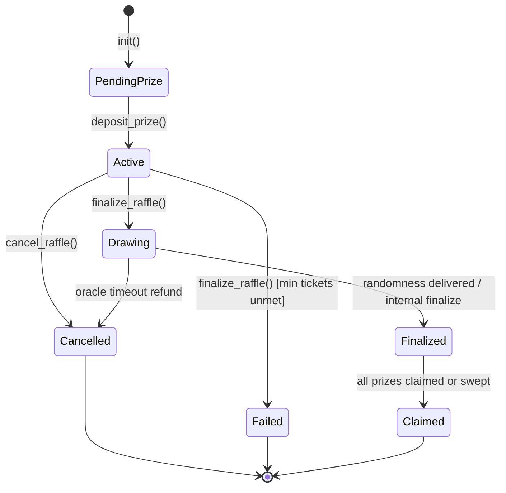

# Glossary

This document defines key terms used throughout Tikka contracts, documentation, and integration guides, with links to their definitions in code.

## Core Concepts

### RaffleStatus

The lifecycle state of a raffle instance. Transitions are enforced by contract logic and represent the canonical on-chain lifecycle used by indexers and clients. Possible states are: `PendingPrize` (prize not yet deposited), `Active` (ticket sales open), `Drawing` (randomness pending), `Finalized` (winners selected), `Cancelled`, `Failed`, or `Claimed` (all winners have collected).

**Canonical transition graph** (defined in code via `RaffleStatus::can_transition_to`):

Terminal states (`Cancelled`, `Failed`, `Claimed`) are absorbing — no entrypoint may move a raffle out of them.

Illegal transitions return `Error::InvalidStateTransition`.

**Code reference**: [`contracts/raffle-shared/src/lib.rs`](../contracts/raffle-shared/src/lib.rs) — `enum RaffleStatus`, `is_terminal()`, `can_transition_to()`

### Raffle

A single instance of a prize draw created and managed by a raffle creator. A raffle specifies the ticket price, prize amount, maximum ticket count, and rules for how a winner is selected. Once a creator deposits the prize, the raffle transitions to `Active` and tickets become available for purchase.

**Code reference**: [`contracts/raffle-instance/src/lib.rs`](../contracts/raffle-instance/src/lib.rs) — `struct Raffle` (via `RaffleConfig`)

### End Time

The Unix timestamp (`Raffle::end_time` / `RaffleConfig::end_time`) after which ticket sales for a raffle close. **The boundary is exclusive of `end_time` itself**: sales are open only while `ledger_timestamp < end_time`, so the instant `ledger_timestamp == end_time` is already past the deadline. This single rule governs three otherwise-independent code paths, which must always agree:

- **Ticket purchases** (`buy_tickets`, `buy_tickets_for`): reject with `Error::RaffleExpired` once `ledger_timestamp >= end_time` (unless `no_deadline` is `true`).
- **Finalization** (`finalize_raffle`): treats the deadline as reached (`time_ended`) once `ledger_timestamp >= end_time`; together with `tickets_full`, this is what allows an `Active` raffle to leave that state.
- **Stats** (`get_stats().time_remaining`): returns `end_time - ledger_timestamp` while `ledger_timestamp < end_time`, and `0` from `ledger_timestamp == end_time` onward. `0` is also returned whenever `no_deadline` is `true`.

When `no_deadline` is `true`, `end_time` is not enforced by any of the above; `RaffleConfig::end_time` must be `0` in that case (checked at `init`).

**Code reference**: [`contracts/raffle-instance/src/lib.rs`](../contracts/raffle-instance/src/lib.rs) — `struct Raffle` (`end_time`, `no_deadline`); [`contracts/raffle-instance/src/tickets.rs`](../contracts/raffle-instance/src/tickets.rs) — `buy_tickets`, `buy_tickets_for`; [`contracts/raffle-instance/src/draw.rs`](../contracts/raffle-instance/src/draw.rs) — `finalize_raffle`; [`contracts/raffle-instance/src/views.rs`](../contracts/raffle-instance/src/views.rs) — `get_stats`

### Ticket

A single entry in a raffle draw owned by a participant. Each ticket represents one chance to win. A ticket is identified by a monotonic `id` unique to the raffle, recorded with the owner's address and purchase timestamp. See [`docs/EVENTS.md`](EVENTS.md) for the `TicketPurchased` event structure.

**Code reference**: [`contracts/raffle-shared/src/lib.rs`](../contracts/raffle-shared/src/lib.rs) — `struct Ticket`

### Prize

The amount (denominated in a Stellar asset) awarded to the winner(s) of a raffle. The creator escrows the prize in the contract at raffle creation. Winners claim their share after the raffle is finalized and the claim lockup period expires.

**Code reference**: [`contracts/raffle-instance/src/lib.rs`](../contracts/raffle-instance/src/lib.rs) — `deposit_prize()` entry point

## Randomness & Drawing

### Randomness Source

The mechanism used to generate randomness for winner selection. Tikka supports three sources: `Internal` (on-chain PRNG seeded from ledger context), `External` (oracle-provided randomness), and `CommitReveal` (multi-phase commit-reveal protocol). The choice trades off cost, latency, and trust assumptions.

**Code reference**: [`contracts/raffle-shared/src/lib.rs`](../contracts/raffle-shared/src/lib.rs) — `enum RandomnessSource`

**Documentation**: [`docs/RANDOMNESS.md`](RANDOMNESS.md) explains the three sources, when to use each, and decision guidance.

### Randomness Type

Classification of the randomness mechanism: `Prng` (on-chain pseudo-random sequence), `Vrf` (verifiable random function from an oracle), or `Fallback` (fallback path used when the preferred mechanism is unavailable).

**Code reference**: [`contracts/raffle-shared/src/lib.rs`](../contracts/raffle-shared/src/lib.rs) — `enum RandomnessType`

### FairnessData

Audit data proving how a draw outcome was derived, including the seed value, randomness source, ticket IDs considered, winning indices, draw timestamp, and draw sequence counter. This structure allows third-party verification that the winner selection was fair and deterministic.

**Code reference**: [`contracts/raffle-shared/src/lib.rs`](../contracts/raffle-shared/src/lib.rs) — `struct FairnessData`

## Fee & Payments

### Protocol Fee

A percentage-based fee currently charged when participants buy tickets. Prize
claims do not currently charge this fee. The fee is expressed in basis points
(100 basis points = 1%). The maximum allowed fee is 20% (2,000 basis points).
Protocol fees are collected by the treasury address.

**Code reference**: [`contracts/raffle-shared/src/lib.rs`](../contracts/raffle-shared/src/lib.rs) — `RaffleConfig.protocol_fee_bp`

**Documentation**: [`docs/FEE_MODEL.md`](FEE_MODEL.md) explains fee collection points, effective cost, and treasury workflows.

### Payment Token

The Stellar asset contract (`Address`) used to buy tickets. The current
raffle-instance initializer also uses it for prize deposits and claims; the
optional `RaffleConfig.prize_token` override exists but is not currently
applied.

**Code reference**: [`contracts/raffle-shared/src/lib.rs`](../contracts/raffle-shared/src/lib.rs) — `RaffleConfig.payment_token`

## Error Handling

### CancelReason

An enum describing why a raffle entered the `Cancelled` state. Reasons include: `CreatorCancelled` (creator-initiated), `AdminCancelled` (governance action), `OracleTimeout` (randomness delivery delay), or `MinTicketsNotMet` (insufficient participation).

**Code reference**: [`contracts/raffle-shared/src/lib.rs`](../contracts/raffle-shared/src/lib.rs) — `enum CancelReason`

**Documentation**: [`docs/ERRORS.md`](ERRORS.md) maps all error codes to user-facing messages suitable for frontend display.

### FailureReason

An enum describing why a raffle entered the `Failed` state. Reasons include: `ZeroTicketsSold` (no participation) or `MinTicketsNotMet` (fewer tickets sold than the configured minimum).

**Code reference**: [`contracts/raffle-shared/src/lib.rs`](../contracts/raffle-shared/src/lib.rs) — `enum FailureReason`

## Pagination & Querying

### PaginationParams

Request structure for paginated list queries, specifying `limit` (max items requested) and `offset` (number of items to skip from the start). Limits are clamped to [1, 200]; a zero limit defaults to 100.

**Code reference**: [`contracts/raffle-shared/src/lib.rs`](../contracts/raffle-shared/src/lib.rs) — `struct PaginationParams`

### PageResultRaffles

Response structure for paginated raffle queries, containing the `items` array (raffle addresses), `total` count of all matching raffles, and `has_more` flag indicating if more records follow.

**Code reference**: [`contracts/raffle-shared/src/lib.rs`](../contracts/raffle-shared/src/lib.rs) — `struct PageResultRaffles`

### PageResultTickets

Response structure for paginated ticket queries, containing the `items` array (tickets), `total` count of all matching tickets, and `has_more` flag.

**Code reference**: [`contracts/raffle-shared/src/lib.rs`](../contracts/raffle-shared/src/lib.rs) — `struct PageResultTickets`

## Administration

### AdminOp

An enum representing administrative operations that may be timelocked or proposed: `SetConfig` (update protocol configuration) or `UpdateWasmHash` (rotate target contract WASM hash for upgrades).

**Code reference**: [`contracts/raffle-shared/src/lib.rs`](../contracts/raffle-shared/src/lib.rs) — `enum AdminOp`

### Metadata Hash

A SHA-256 hash of off-chain metadata JSON (stored on IPFS) that describes the raffle name, full rules, image, and description. The hash is committed on-chain at raffle creation and is immutable, preventing organizers from altering raffle terms after tickets are sold. Participants can download the metadata and verify it matches the on-chain hash.

**Code reference**: [`contracts/raffle-shared/src/lib.rs`](../contracts/raffle-shared/src/lib.rs) — `RaffleConfig.metadata_hash`

**Documentation**: See [`../README.md`](../README.md) section "Metadata Integrity (metadata_hash)" for hash generation and verification examples.

## Oracle Integration

### RandomnessRequest

A request payload sent from a raffle instance to an oracle contract, specifying the target raffle address, a unique request ID for correlation, and the callback address expected to receive the randomness response.

**Code reference**: [`contracts/raffle-shared/src/lib.rs`](../contracts/raffle-shared/src/lib.rs) — `struct RandomnessRequest`

### RandomnessOracleTrait

A contract trait (interface) implemented by oracle contracts. It defines the `request_randomness()` entry point that raffle instances call to request randomness for a draw.

**Code reference**: [`contracts/raffle-shared/src/lib.rs`](../contracts/raffle-shared/src/lib.rs) — `trait RandomnessOracleTrait`

### RandomnessReceiverTrait

A contract trait (interface) that raffle instances implement to receive randomness callbacks from oracle contracts. It defines the `receive_randomness()` entry point, which the oracle invokes with the request ID and random seed.

**Code reference**: [`contracts/raffle-shared/src/lib.rs`](../contracts/raffle-shared/src/lib.rs) — `trait RandomnessReceiverTrait`

## Related Documentation

- **Key Terms**: Hyperlinks in this glossary reference sections of the code and other documentation files.
- **Architecture Overview**: See [`ARCHITECTURE.md`](ARCHITECTURE.md) for diagrams of the factory → instance → oracle flow.
- **API Reference**: See [`EVENTS.md`](EVENTS.md) for event structures and [`ERRORS.md`](ERRORS.md) for error code reference.
